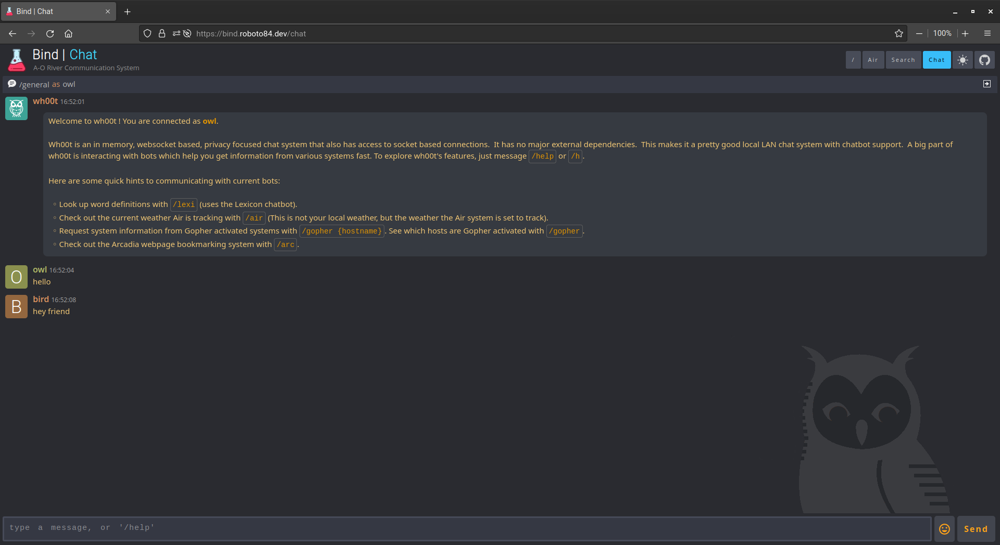
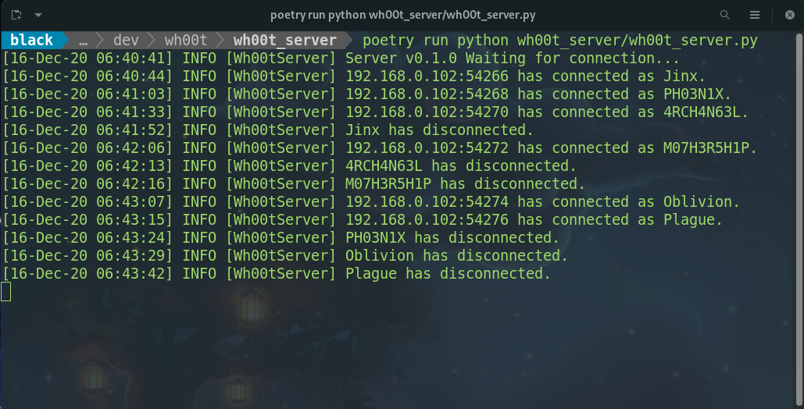

<h1 align="center">wh00t_server</h1>

<div align="center">
	
</div>

## About
`Wh00t` is a simple Python LAN chat server. `wh00t_server` functions as part of the larger **Wh00t** project. This particular repository's purpose is to act as a chat room server.

## Install
To see `wh00t_server` used on the `bind_ui` go to the [Bind](https://github.com/roboto84/bind) repo and follow its README.

<div align="center">
	
    <br/>
    Wh00t on Bind UI
    <br/><br/>
</div>

However, if you would like to run `wh00t_server` outside of `Bind` follow these instructions:

This project is managed with [Poetry](https://github.com/python-poetry/poetry). With Poetry installed correctly, simply clone this project and install its dependencies:
- Clone repo
    ```
    git clone https://github.com/roboto84/wh00t_server.git
    ```
    ```
    cd wh00t_server
    ```
- Install dependencies
    ```
    poetry install
    ```

## Environmental Variables
- You must create a `.env` file with the following environmental variables set:
    - `SERVER_PORT` : The port upon which you would like the server to listen to incoming client connections.

- An explained ``.env`` file format is shown below:
    ```
    SERVER_PORT=<Server port number>
    ```

- A typical ``.env`` file may look like this:
    ```
    SERVER_PORT=3001
    ```

## Usage
- Run the script once the environment (`.env`) file is created:
    ```
    poetry run python wh00t_server/wh00t_server.py
    ```

<div align="center">
    
    <br/>
    wh00t_server running
</div>

## Logs
The server logs are generated in the project's root directory's log folder.

## Commit Conventions
Git commits follow [Conventional Commits](https://www.conventionalcommits.org) message style as explained in detail on their website.

<br/>
<sup>
    <a href="https://www.flaticon.com/free-icons/owl" title="owl icon">
        wh00t_server icon created by Freepik - Flaticon
    </a>
</sup>

