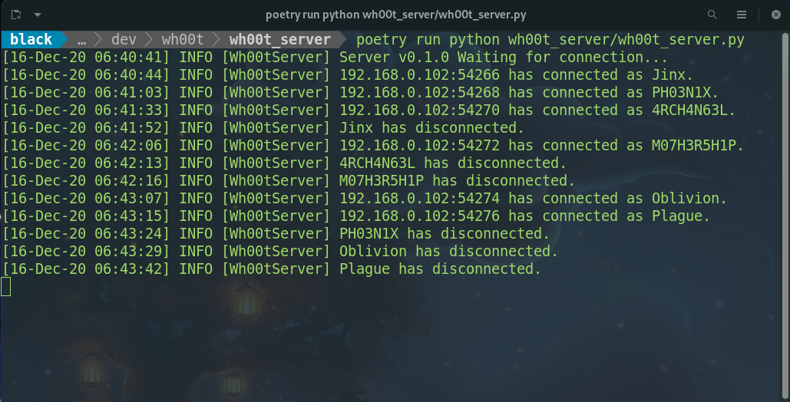

=================
wh00t_server
=================

Simple python LAN chat server

Installation
------------
This project is managed with Python Poetry (https://github.com/python-poetry/poetry). With Poetry installed correctly,
simply clone this project and run::

    poetry install

To test the project, run::

    poetry run pytest

In order to run the program functions, see below.

Introduction
------------
This project functions as part of the larger wh00t project. This particular repository's purpose is
to act as a chat room server.

wh00t_server.py
~~~~~~~~~~~~~~~~~~~~~~
This process functions as the main wh00t chat server. wh00t_server.py requires that an ``.env`` file is available
in the *same* directory it is running under. The format of the .env file should contain ``SERVER_PORT`` as a
defined environmental variable.

| ``SERVER_PORT`` : The port upon which you would like to the server to listen to incoming client connections

An explained ``.env`` file format is shown below::

    SERVER_PORT=<Server port number>

A typical ``.env`` file may look like this::

    SERVER_PORT=3001

To run the script once the environment (.env) file is created, from within the wh00t_server directory, simply type::

    poetry run python wh00t_server/wh00t_server.py

Logs
-----
The server logs are generated in the project's root directory's log folder.

Commit Conventions
----------------------
Git commit conventions follows Conventional Commits message conventions explained in detail on their website
(https://www.conventionalcommits.org)

